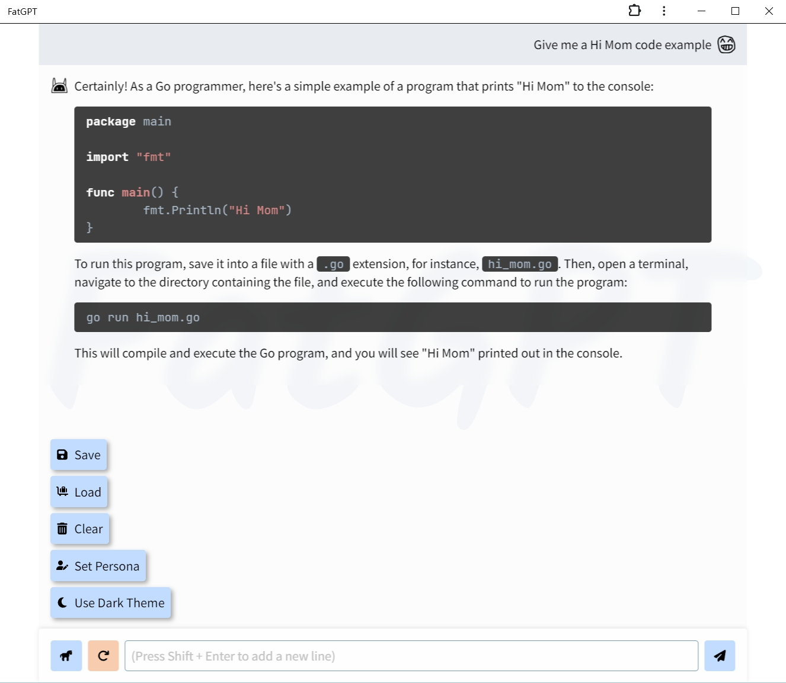
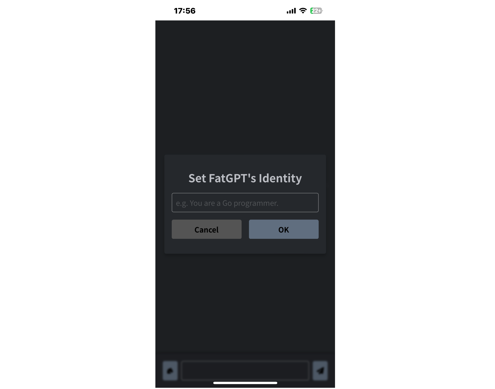

# FatGPT

Frontend wrapper of ChatGPT

## Showcase

## Architecture

FatGPT relies on the projects below:

1. OAuth2.0: [my-oauth](https://github.com/zenpk/my-oauth)
2. WebSocket for streaming the messages: [ws-gpt](https://github.com/zenpk/ws-gpt)

This project is built for my own convenience, so you shouldn't expect to host it without any issues. If you happen to be
interested, feel free to contact me :)
